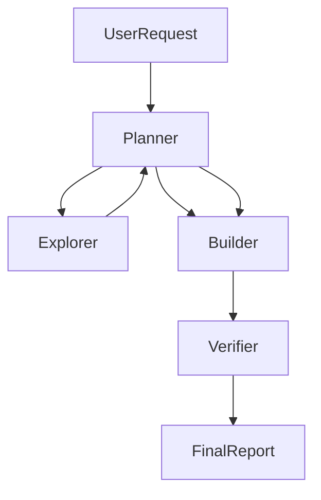

# M3 Example: Agent-Team Product Prototype

This example shows a concrete M3 + Cursor 3 agent-team workflow for turning a vague product request into a verified prototype without collapsing every responsibility into one agent.

Use it together with:

- `.cursor/rules/agent-teams.mdc`
- `.cursor/rules/cursor-agent-orchestration.mdc`
- `.cursor/rules/minimax-m3-status-verification.mdc`

## When To Use

Use this pattern when:

- the request spans product framing, code exploration, implementation, and verification
- multiple valid approaches exist and should be compared before editing
- one agent would otherwise accumulate too much context

Do not use it for one-file fixes or straightforward localized work.

## Team Shape



## Roles

### Planner

Owns:

- outcome definition
- task slicing
- deciding serial vs parallel branches
- final synthesis

Returns:

- bounded subagent scopes
- implementation order
- acceptance checks

### Explorer

Owns:

- repo reconnaissance
- locating existing patterns
- surfacing constraints and risks

Returns:

- relevant files or directories
- reusable patterns
- open questions that materially affect the build

### Builder

Owns:

- implementation of the approved slice
- smallest coherent batch of edits
- targeted local verification during build

Returns:

- changed files
- unresolved risks
- recommended proof steps

### Verifier

Owns:

- challenge assumptions
- run or inspect the strongest relevant checks
- downgrade claims that are not fully proved

Returns:

- what is verified
- what remains unverified
- what is blocked

## Handoff Template

Each handoff should include:

```text
Goal:
Repo / workspace root:
Environment: local | /worktree | cloud | SSH
Model: MiniMax-M3 | composer-2 | auto | ...
Owned surface:
What changed or was learned:
Open risks or assumptions:
Next required action:
```

The environment and model fields are M3 + Cursor 3 defaults — name them so a reviewer can reproduce the run and so that `/best-of-n` comparisons stay legible.

## Example Delegation

### Step 1: Planner

Break a task like "build an internal operations dashboard prototype" into:

- explorer: find existing dashboard layout, auth, and data-fetch patterns
- builder: implement one vertical slice only after exploration returns
- verifier: check build, lint, and user-surface behavior before completion

### Step 2: Explorer

Good prompt:

```text
Explore the repo for existing dashboard shells, data table patterns, and chart usage.
Return only:
1. the best files to reuse
2. risks or missing infrastructure
3. a recommendation for the smallest proving slice
Do not edit files.
```

### Step 3: Builder

Good prompt:

```text
Implement only the approved proving slice:
- one dashboard route
- one data card
- one verified chart or list
Reuse existing patterns from the explorer output.
Do not broaden scope.
```

### Step 4: Verifier

Good prompt:

```text
Verify the implemented slice.
Return:
1. checks run
2. evidence for each check
3. what remains unverified
4. whether the work is verified, unverified, or blocked
Do not edit unless asked.
```

## Why This Pattern Fits M3 + Cursor 3

It matches the M3 + Cursor 3 emphasis on:

- role boundaries
- multi-agent collaboration
- strong repo-scale reasoning
- evidence-backed delivery (`verified` / `unverified` / `blocked` / `multimodal-grounded`)
- 1M-token long-context discipline when the team reads across a large repo
- native multimodal input when the user attaches a mock, screenshot, or screen recording

A few M3 + Cursor 3 mechanics that make this pattern stronger:

- **`/best-of-n` for the design / architecture decision.** When the team needs to pick the strongest architecture, layout, or refactor approach, run the same prompt to 2–4 models in parallel `/worktree` sessions and synthesize. The "verifier" role then reads all outputs and picks or merges.
- **`Await` for long-running branches.** If the verifier triggers a long-running check (browser load, e2e run, build), do not poll; use the `Await` tool on the background shell or a specific output token (`Ready`, `Compiled`, `Error`).
- **Visual work goes through `multimodal-grounded`.** When the prototype has visual claims (a screenshot, a mock, a recorded interaction), the verifier re-reads the actual post-change frame and states `multimodal-grounded` — not `verified` from prose memory.
- **Long-context loader plan.** On M3 the planner should also produce a 4–6 line loader plan (what is in context at start, what to add verbatim, what to summarize, what to drop, when to compress) before kicking off the explorer and builder. See the `minimax-m3-long-context` skill.

The point is not to maximize the number of agents. The point is to use role separation only when it reduces context load and improves verification quality.
